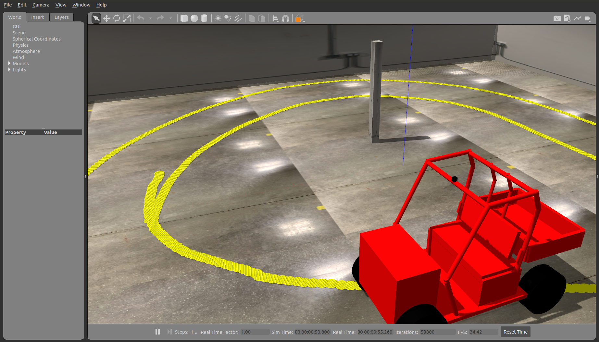
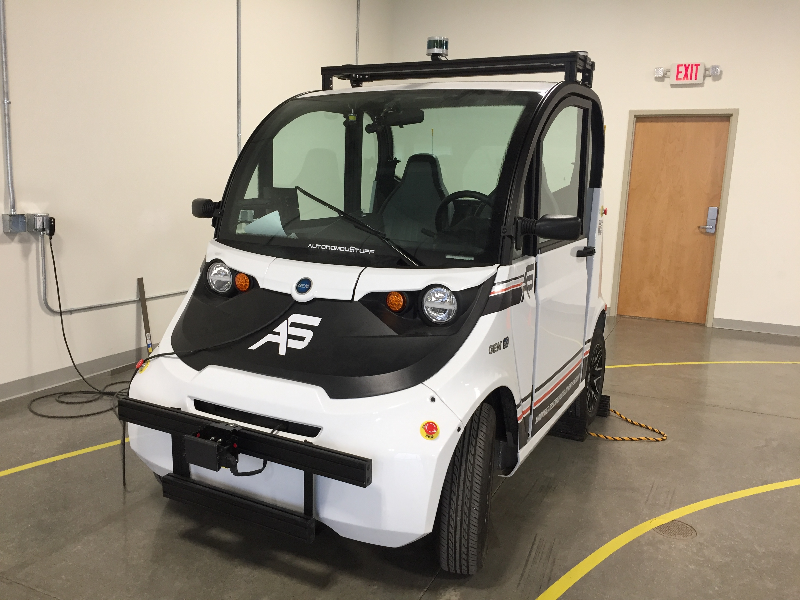
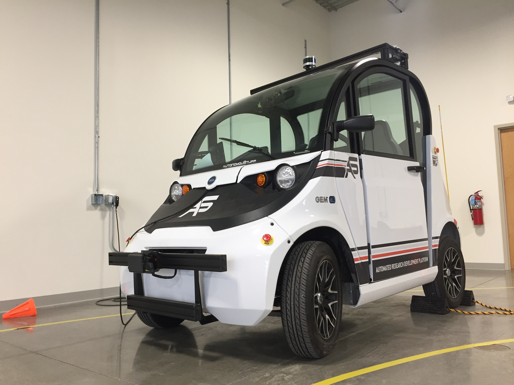

# Overview

This repository contains code and documentation for the GEM Smart vehicle 
developed by the research groups of Professors Katherine Driggs-Cambell and 
Sayan Mitra. This project started in Summer 2019.

  
  
  
  

# Modules
 * Lane detection
 * Pedestrian detection
 * GPS
 * Steering control 
 
# Active contributors
 * Peter Du
 * Katherine Driggs-Cambell
 * Qichao Gao (Vincent)
 * Tianqi Liu (Ted)
 * Sayan Mitra
 * Ke Xu (Richard)
 * David Young

# Alumni
 * David Young
